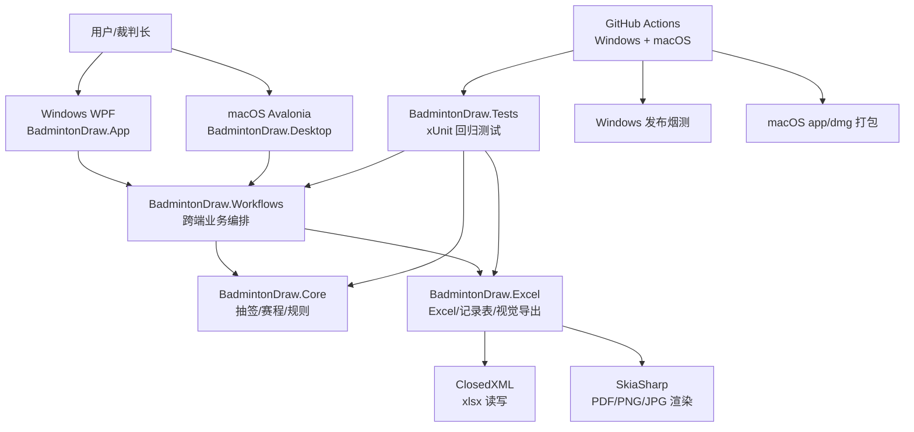

# SZU-Badminton-Draw 项目接续上下文

本文用于在 Windows、macOS、不同电脑或新 Codex 线程之间继续开发。它不是用户手册，而是维护者工作记忆。

更新时间：2026-06-12
当前主仓库：`https://github.com/TonyHuang6666/SZU-Badminton-Draw`
当前主分支：`main`
当前接续状态：准备发布 `v3.3.0`，重点为赛事存档、记录表导入确认和 macOS GUI 细节。

## 最高优先级原则

后续所有开发都以“一次开发，多端部署”为目标。

- 新功能优先落在共用层：`BadmintonDraw.Core`、`BadmintonDraw.Excel`、`BadmintonDraw.Workflows`。
- Windows WPF 项目 `BadmintonDraw.App` 和 macOS/Linux Avalonia 项目 `BadmintonDraw.Desktop` 只做薄 UI、文件选择、弹窗确认、状态展示。
- 不允许只在 macOS 或只在 Windows 实现核心业务逻辑。除非是窗口尺寸、平台文件选择器、打包脚本这类平台特有行为。
- 每个影响业务流程的新功能，都应优先补 xUnit 测试，测试尽量调用 `BadmintonDraw.Workflows`，而不是绑定某一个 GUI。
- Windows 和 macOS 的功能文案、导出文件、校验提醒、默认参数应尽量一致。

## 当前项目定位

这是一个面向深圳大学羽毛球赛事的抽签、对阵表、赛程编排和现场执行工具。

目标流程：

```text
名单导入
-> 规则化抽签
-> 对阵表导出
-> 赛程编排
-> 当日记录表/时间场地表/对阵表导出
-> 现场填写结果
-> 导入结果并刷新后续比赛日
-> 循环推进到决赛和名次赛
```

项目保留校园赛事的现实变通：

- 校区预选后再合并。
- 同学院、同单位选手尽量回避。
- 场馆、场地、日期资源有限。
- 裁判长可人工确认异常比分、弃权、顺延补赛。
- 名次附加赛必须不晚于冠军决出日。

## 技术栈

- 语言：C# / .NET 8
- Windows GUI：WPF，项目为 `src/BadmintonDraw.App`
- macOS/Linux GUI：Avalonia，项目为 `src/BadmintonDraw.Desktop`
- Excel 读写：ClosedXML
- 赛事存档：Microsoft.Data.Sqlite / SQLite，扩展名 `.szbd`
- JPG/PNG/PDF 渲染：SkiaSharp
- 测试：xUnit
- Windows 发布：win-x64 self-contained
- macOS 发布：`scripts/publish-macos.sh` 生成 `.app` 和 `.dmg`，目前未签名、未公证

## 当前框架



### 分层职责

`src/BadmintonDraw.Core`

- 抽签核心算法。
- 赛程编排核心算法。
- 规则、阶段、名次赛、资源不足预览。
- 不依赖 Excel 和 GUI。

`src/BadmintonDraw.Excel`

- 名单模板。
- 名单导入。
- 抽签结果 Excel。
- 赛程表 Excel。
- 对阵记录表。
- 导入比赛结果。
- `.szbd` 赛事进度存档读写、事务更新、备份和完整性检查。
- Excel 到 JPG/PNG/PDF 视觉导出。

`src/BadmintonDraw.Workflows`

- GUI 共享业务门面。
- 统一默认文件名。
- 统一导出格式矩阵。
- 统一赛程设置构建、场地解析、记录表导入提醒。
- Windows 和 macOS 都应通过这一层调用业务能力。

`src/BadmintonDraw.App`

- Windows WPF GUI。
- 只处理控件、弹窗、文件选择、状态提示。

`src/BadmintonDraw.Desktop`

- Avalonia 跨平台 GUI，目前主要面向 macOS。
- 目标是尽量复刻 Windows 功能。
- 只处理平台 UI，不重复实现业务逻辑。

`tests/BadmintonDraw.Tests`

- 核心回归测试。
- 当前覆盖抽签、赛程、导出、记录表导入、多格式导出、字体回退等。

## 当前已完成能力

### 抽签与对阵表

- 单项淘汰赛、单项循环赛、团体淘汰赛、团体循环赛。
- 自动识别单打、双打、团体名单。
- 官方种子签位保护。
- 非 2 的幂人数自动生成首轮赛和轮空。
- 小组数为 2 的幂时支持“每组出线”或“决出冠军”。
- 小组数不是 2 的幂时自动隐藏/降级不适用的淘汰目标。
- 支持 3/4 名赛、3-8 名附加赛。
- 名次附加赛排布和线条已按用户给的校长杯形式优化。

### 赛程编排

- 多比赛日、多场地、每日最多场次。
- 资源不足时支持预览，未安排场次用特殊颜色标记，但不支持导出不完整赛程。
- 支持分界线前后不同单场耗时、每日最多场次。
- 休息间隔已取消，建议把必要缓冲融入单场比赛时长。
- 赛程排序已平衡：尽量先完成早阶段，同时避免同一选手连续上场。
- 附加赛强制不晚于冠军决出日。
- 默认场馆倾向：运动广场东馆羽毛球场，场地默认可填 `B1-C8`。

### 导出

- 对阵表支持 Excel、JPG、透明 PNG、A4 PDF、全部导出。
- 赛程表支持 Excel、JPG、透明 PNG、A4 PDF、全部导出。
- 可同步导出带比赛时间和场地的对阵表。
- A4 PDF 淘汰赛支持行列分页参数。
- 循环赛 PDF 自动封面和每组单独分页。
- macOS 视觉导出已加入字体回退，避免中文变方块。
- 大图导出已限制画布尺寸，避免 macOS 透明 PNG 崩溃。

### 对阵记录表与结果导入

- 可单独导出当日赛程记录表。
- 记录表首行含示例。
- 正式比赛行比分、用时、胜方首次导出留空。
- 对阵数据拆为左右选手和 `vs`。
- 胜方单元格支持下拉选择本场 A/B。
- 后续占空对阵会在前序胜者填入后自动生成带选手的对阵。
- 可导入一张或多张记录表，合并累计结果后导出下一比赛日记录表。
- 同一场多表结果一致则通过；胜方冲突则强制拦截。
- 未填胜方、比分与胜方方向不一致、弃权无比分等作为弹窗提醒，可手动确认继续；提醒会逐条列出，并按记录表第一列“序号”定位。
- 未完成比赛可顺延到下一比赛日记录表。

### 赛事进度存档

- Windows 和 macOS 均可创建、打开 `.szbd` 赛事存档。
- 存档包含抽签、参赛单位、完整赛程、累计结果、顺延补赛、已处理比赛日和导入日志。
- GUI 中的“待决”按 `赛程总场数 - 已完成结果数` 计算，不等同于顺延补赛数。
- 打开存档后不依赖原始名单文件即可恢复赛事。
- 新版记录表包含隐藏赛事 ID，误导入其他赛事会被拦截。
- 文件 SHA-256 用于避免重复导入。
- 胜负方冲突强制阻止；比分、用时或比赛日更正需确认，并保留历史值。
- SQLite 事务保证整次导入成功或整体回滚。
- 每次有效更新前自动备份，最多保留最近 10 份。

### Windows/macOS 状态

- Windows WPF 功能较完整，是当前成熟版本。
- macOS Avalonia 已可运行，并已补齐大量核心流程。
- Windows 和 macOS 均已接入 `BadmintonDraw.Workflows`。
- GitHub Actions 已包含 Windows 构建测试和 macOS `.dmg` 打包。

## 仍未完成的大项

### 1. 单场比赛计分表

还没做。用户可能后续提供模板。

建议先做基础版：

```text
根据当日赛程记录表
-> 批量生成每场比赛的单场计分表
-> 支持一场一页或多场一页
```

计分表应包含：

- 日期、时间、场地。
- 组别、阶段、场次标识。
- A/B 双方。
- 每局比分填写区。
- 胜方、裁判、记录员、备注。

后续可以和记录表联动，但第一版不必识别扫描件或复杂手写。

### 2. 导入结果后导出下一日完整材料包

当前只能导出下一比赛日记录表。后续目标是：

```text
导入记录表/进度文件
-> 更新累计结果
-> 导出下一比赛日记录表
-> 导出下一比赛日时间场地表
-> 导出下一比赛日带时间对阵表
-> 导出下一比赛日单场计分表
```

这会形成真正的比赛执行闭环。

### 3. 跨项目冲突处理

例如同一名同学同时参加男双和混双。

建议不要一开始做自动全局排程。先做轻量版：

- 导入多个项目赛程。
- 抽取选手姓名。
- 检查同一时间段或过近时间段冲突。
- 输出冲突报告。
- 允许裁判长人工调整。

稳定后再考虑自动避让。

### 4. 高级赛程约束

可逐步添加：

- 半决赛、决赛指定中心场地。
- 决赛之间留更长间隔。
- 重点场次避开同时开打。
- 裁判数量约束。
- 特定选手/队伍时间不可用。
- 特定场地不可用时段。

这些约束容易互相冲突，应先以“提醒/报告”为主，再做自动安排。

### 5. macOS 正式发布链路

当前 `.app/.dmg` 可以构建，但还不是正式签名包。

后续：

- Apple Developer ID 签名。
- Notarization 公证。
- Staple 到 `.app` 或 `.dmg`。
- 验证首次打开体验。

## 建议下一步开发顺序

1. 做 `导入结果后导出下一日完整材料包`。
2. 做基础版 `单场比赛计分表`。
3. 做跨项目冲突报告。
4. 做高级赛程约束。
5. 做 macOS 签名和正式发布。

## macOS 开发方式

推荐用 VS Code，不建议依赖 Visual Studio for Mac。

首次确认 .NET：

```bash
dotnet --info
```

需要 .NET 8 SDK/Runtime。只有 .NET 10 不够跑当前项目。

常用命令：

```bash
dotnet restore BadmintonDraw.sln
dotnet build BadmintonDraw.sln
dotnet test BadmintonDraw.sln
dotnet run --project src/BadmintonDraw.Desktop/BadmintonDraw.Desktop.csproj
```

macOS 打包：

```bash
bash scripts/publish-macos.sh osx-arm64
```

输出位置：

```text
artifacts/macos/osx-arm64/SZU-Badminton-Draw_osx-arm64.dmg
```

## Windows 开发方式

Windows GUI：

```powershell
dotnet run --project src\BadmintonDraw.App\BadmintonDraw.App.csproj
```

Windows 全量验证：

```powershell
dotnet restore BadmintonDraw.sln --locked-mode
dotnet build BadmintonDraw.sln --no-restore
dotnet test BadmintonDraw.sln --no-build --verbosity normal
```

## Git 和 CI 注意事项

在当前网络环境中，Windows 虚拟机里执行 Git 推送建议带代理：

```powershell
$env:HTTP_PROXY='http://127.0.0.1:7897'
$env:HTTPS_PROXY='http://127.0.0.1:7897'
git push origin main
```

每次重要提交前建议跑：

```bash
dotnet restore BadmintonDraw.sln --locked-mode
dotnet build BadmintonDraw.sln --no-restore
dotnet test BadmintonDraw.sln --no-build --verbosity normal
```

GitHub Actions 当前包含：

- Windows build/test/publish smoke test。
- macOS build/test/app/dmg packaging。

如果 GitHub 首页出现红叉，优先看 Actions 日志，不要只看本地是否能跑。

## 新功能开发守则

以后开发新能力时，优先按这个顺序切：

1. `BadmintonDraw.Core`：是否有纯规则或调度算法。
2. `BadmintonDraw.Excel`：是否有文件输入输出。
3. `BadmintonDraw.Workflows`：是否需要给 GUI 一个统一业务入口。
4. `BadmintonDraw.App`：Windows WPF UI 接入。
5. `BadmintonDraw.Desktop`：macOS Avalonia UI 接入。
6. `BadmintonDraw.Tests`：补跨端共享测试。
7. `docs` / `README`：补用户可见说明。

判断一个改动是否合格：

- Windows 和 macOS 是否都能用。
- 是否没有复制核心业务逻辑到 GUI 层。
- 是否有 workflow 或 core/excel 层测试。
- 是否导出文件名、工作表名、提醒文案一致。
- 是否能处理校园比赛中常见的人工变通。

## 当前最重要的接棒任务

建议下一位开发者或 Codex 从这里开始：

```text
实现导入结果后导出下一比赛日完整材料包。
```

最小可交付版本：

1. 从 `.szbd` 读取累计结果和下一比赛日。
2. 一次导出下一日记录表、时间场地表和带时间场地对阵表。
3. 为后续单场计分表预留材料包入口。
4. Windows 和 macOS 同时接入。
5. 补共享工作流测试。
